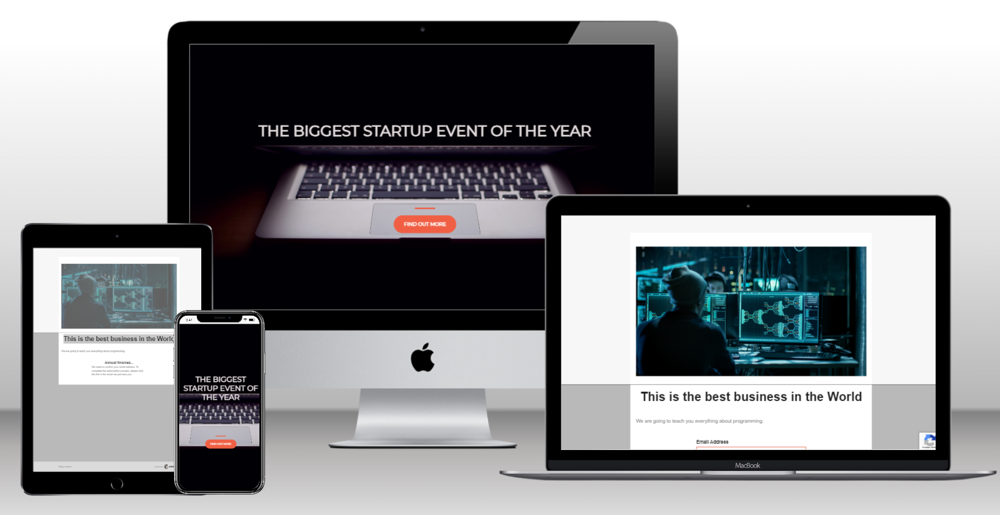

# startup-idea


<a name="readme-top"></a>
<div align="center">
  
  <br/>

  <h3><b>Startup Idea</b></h3>

</div>

<!-- TABLE OF CONTENTS -->

# 📗 Table of Contents

- [📖 About the Project](#about-project)
  - [🛠 Built With](#built-with)
    - [Tech Stack](#tech-stack)
    - [Key Features](#key-features)
  - [🚀 Live Demo](#live-demo)
- [💻 Getting Started](#getting-started)
  - [Setup](#setup)
  - [Prerequisites](#prerequisites)
  - [Install](#install)
  - [Usage](#usage)
  - [Run tests](#run-tests)
  - [Deployment](#triangular_flag_on_post-deployment)
- [👥 Authors](#authors)
- [🔭 Future Features](#future-features)
- [🤝 Contributing](#contributing)
- [⭐️ Show your support](#support)
- [🙏 Acknowledgements](#acknowledgements)
- [❓ FAQ (OPTIONAL)](#faq)
- [📝 License](#license)

<!-- PROJECT DESCRIPTION -->

# 📖 [Startup Idea] <a name="about-project"></a>

This is a simple, one-page website for an upcoming startup event. The website uses Bootstrap for its layout and styling, and includes a custom stylesheet for additional design tweaks. The website features a full-screen background image and a prominent call-to-action button to sign up for more information about the event. The tech stack includes HTML, CSS, and Bootstrap.

## 🛠 Built With <a name="built-with"></a>

### Tech Stack <a name="tech-stack"></a>

<details>
  <summary>Client</summary>
  <ul>
    <li><a href="https://developer.mozilla.org/en-US/docs/Web/HTML">HTML</a></li>
    <li><a href="https://developer.mozilla.org/en-US/docs/Web/CSS">CSS</a></li>
    <li><a href="https://developer.mozilla.org/en-US/docs/Web/JavaScript">JavaScript</a></li>
  </ul>
</details>

<!-- Features -->

### Key Features <a name="key-features"></a>

- **Responsive landing page.**

<p align="right">(<a href="#readme-top">back to top</a>)</p>

<!-- LIVE DEMO -->

## 🚀 Live Demo <a name="live-demo"></a>

- [Live Demo Link](https://alejandroq12.github.io/startup-idea/ )

<p align="right">(<a href="#readme-top">back to top</a>)</p>

<!-- GETTING STARTED -->

## 💻 Getting Started <a name="getting-started"></a>

To get a local copy up and running, follow these steps.

### Prerequisites

In order to run this project you need:

- Only a web browser.

### Setup

Clone this repository to your desired folder:

  cd my-folder
```
  git clone https://github.com/Alejandroq12/startup-idea.git
```

### Install

Install this project with:

For this project you just need to install a web browser.

### Usage

To run the project:

Just open the `index.html` file with your web browser.

### Run tests

To run tests, run the following command:

Tests will be available in the future.

### Deployment

You can deploy this project using GitHub pages:

1. Log in to your GitHub account and navigate to the repository that contains your website files.
2. Make sure that your website files are located in the main branch and in the root directory of the repository.
3. If your website is not already live, make sure that the index.html file is the main page of your website.
4. Click on the "Settings" tab in your repository.
5. Scroll down to the "GitHub Pages" section.
6. In the "Source" dropdown menu, select the branch where your website files are located. For a simple website with only HTML and CSS, this is typically the main branch.
7. In the "Path" field, make sure that the root directory is specified (i.e., "/").
8. Click "Save" to generate your website.
9. Wait a few minutes for GitHub to build and deploy your website.
10. Once the website is deployed, visit the GitHub Pages URL to view your site.

<p align="right">(<a href="#readme-top">back to top</a>)</p>

<!-- AUTHORS -->

## 👥 Author <a name="authors"></a>

👤 **Julio Quezada**

- GitHub: [Alejandroq12](https://github.com/Alejandroq12)
- Twitter: [@JulioAle54](https://twitter.com/JulioAle54)
- LinkedIn: [Julio Quezada](https://www.linkedin.com/in/quezadajulio/)

<p align="right">(<a href="#readme-top">back to top</a>)</p>

<!-- FUTURE FEATURES -->

## 🔭 Future Features <a name="future-features"></a>

- [ ] **I will add more interactivity with JavaScript.**
- [ ] **I will add more pages.**

<p align="right">(<a href="#readme-top">back to top</a>)</p>

<!-- CONTRIBUTING -->

## 🤝 Contributing <a name="contributing"></a>

Contributions, issues, and feature requests are welcome!

Feel free to check the [issues page](../../issues/).

<p align="right">(<a href="#readme-top">back to top</a>)</p>

<!-- SUPPORT -->

## ⭐️ Show your support <a name="support"></a>

If you like this project please give a star.
Thanks in advance.

<p align="right">(<a href="#readme-top">back to top</a>)</p>

<!-- ACKNOWLEDGEMENTS -->

## 🙏 Acknowledgments <a name="acknowledgements"></a>

I would like to thank Wes Bos because I learned how to implement flexbox with his free tutorial:
- Wes Bos: [Wes Bos](https://flexbox.io/)

<p align="right">(<a href="#readme-top">back to top</a>)</p>

<!-- FAQ (optional) -->

## ❓ FAQ (OPTIONAL) <a name="faq"></a>

- **What did you learn with this project?**

  - The best part wast the Mailchimp integration.

<p align="right">(<a href="#readme-top">back to top</a>)</p>

<!-- LICENSE -->

## 📝 License <a name="license"></a>

This project is [MIT](./LICENSE) licensed.

<p align="right">(<a href="#readme-top">back to top</a>)</p>
